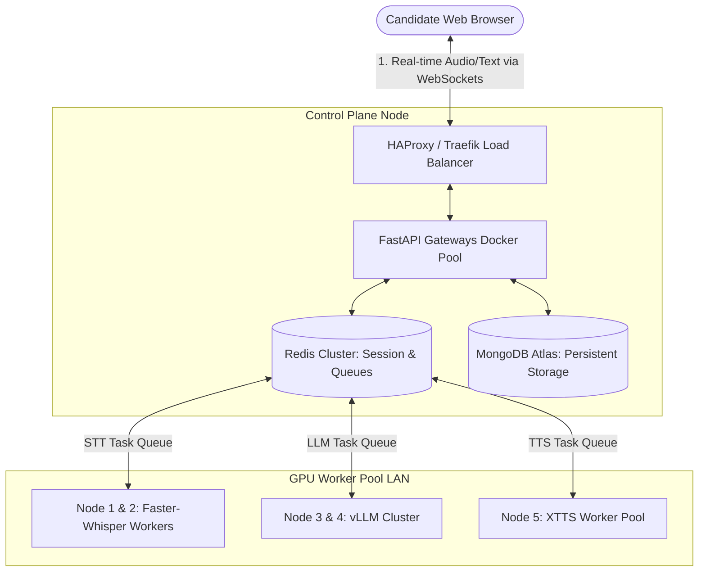

# Enterprise Production Architecture & Scaling Blueprint

This document details the blueprint for scaling the **AI Mock Interview Trainer** from a single-node system to a highly scalable, zero-lag enterprise platform. It uses a **Distributed Microservices Architecture** driven by **WebSockets** and **Event-Driven Task Queues** across a cluster of **6 physical machines** (1 Central Controller Node + 5 Dedicated GPU Nodes).

---

## 1. System Topology Overview

The architecture transitions the application from a monolith into fully decoupled, horizontal-scaling microservices.



---

## 2. Infrastructure & System Breakdown (6 Nodes)

To run a zero-lag spoken interview, we separate workloads into distinct machines. 

### Machine 1: The Control Plane (No GPU Required)
* **Purpose:** Handles request routing, WebSocket termination, session state, databases, and monitoring.
* **Services:**
  - **FastAPI Gateway (Load-balanced):** Terminates client WebSocket connections, coordinates database reads/writes.
  - **Redis Cluster:** Stores active session states, manages rate limits, and orchestrates task queues.
  - **MongoDB:** Persists user authentication, job descriptions, and completed interview reports.
  - **Prometheus & Grafana:** Monitors VRAM, GPU temperatures, queue sizes, and endpoint latencies.

### Machine 2 & 3: STT (Speech-to-Text) Worker Nodes (12GB VRAM GPU)
* **Model:** `faster-whisper-large-v3` (running under FP16 or INT8 quantization).
* **VRAM footprint:** ~2.5 GB to 3.0 GB per worker instance.
* **Configuration:** Runs 2 parallel Whisper worker containers per machine.
* **Capacity:** Node 2 & 3 combined can handle **150 to 200 concurrent incoming audio streams**.

### Machine 4 & 5: LLM (Large Language Model) Nodes (12GB VRAM GPU)
* **Engine:** **vLLM** (specifically optimized for high throughput, paged attention, and continuous batching).
* **Model:** `Mistral-Nemo-12B-Instruct` (Q4 or AWQ quantization).
* **VRAM footprint:** ~7.5 GB.
* **Why vLLM over Ollama?** Ollama runs requests sequentially in a queue. `vLLM` continuously batches requests in parallel using GPU acceleration, boosting concurrency by **10x**.
* **Capacity:** Node 4 & 5 combined can support **30 to 40 active token generations** (equivalent to **150+ concurrent candidates** actively thinking/talking).

### Machine 6: TTS (Text-to-Speech) Node (12GB VRAM GPU)
* **Model:** `Coqui XTTS v2` (configured for streaming).
* **VRAM footprint:** ~2.5 GB per synthesis worker.
* **Configuration:** Runs 4 parallel XTTS worker containers.
* **Capacity:** Can handle **100+ simultaneous audio synthesis streams**. Since TTS is highly GPU-intensive, Node 6 will be the scaling boundary (add a second TTS node when expanding beyond 150 concurrent users).

---

## 3. Distributed Hybrid Communication Protocol

To deliver a conversational feel, we combine three distinct patterns: **WebSockets**, **Redis Pub/Sub Event Queues**, and **Pipelined Sentence Chunking**.

### The Real-Time Voice Pipeline Workflow
1. **Audio Streaming (Client to STT):** The browser streams audio packets (100ms chunks) over WebSockets to the FastAPI Gateway. The Gateway pushes them into the Redis `STT_Queue`.
2. **Rolling Transcription:** Whisper workers consume audio chunks, transcribing speech incrementally. A local **Voice Activity Detection (VAD)** system detects silence (indicating the user has finished speaking).
3. **Event Generation:** The STT worker pushes the final transcript back to the Gateway.
4. **Token Streaming (LLM to Gateway):** The Gateway forwards the transcript to the vLLM queue. The vLLM server begins streaming output tokens immediately.
5. **Sentence Pipelining (Gateway to TTS):** The Gateway buffers incoming LLM tokens. The moment a complete sentence is generated, the Gateway sends it to the `TTS_Queue`.
6. **Audio Chunk Playback:** The TTS worker synthesizes the first sentence and streams the raw WAV chunks back to the Gateway, which sends them to the client browser. The candidate hears the first sentence while sentences 2 and 3 are still being processed by the LLM.

```
Candidate Speaks ──> [STT Worker] 
                          │ (VAD Stop Detected)
                          ▼
Candidate Hears <── [TTS Node] <── [FastAPI Gateway] <── [vLLM Node]
                      (Sentence 1)       (Buffer)          (Streaming Tokens)
```

---

## 4. Alternative 5-Node Configuration
If only 5 physical machines are available, the Control Plane is collapsed into Machine 1 to share CPU/RAM resources with the STT workload:

* **Machine 1 (Control Plane + STT):** FastAPI Gateway + Redis + MongoDB + 1x Whisper worker.
* **Machine 2 (STT Node):** 2x Whisper workers.
* **Machine 3 (LLM Node):** vLLM (Mistral-Nemo 12B).
* **Machine 4 (LLM Node):** vLLM (Mistral-Nemo 12B).
* **Machine 5 (TTS Node):** 4x XTTS workers.

---

## 5. Summary of Technologies Used

| Layer | Technology | Primary Method | Purpose |
| :--- | :--- | :--- | :--- |
| **Messaging** | Bidirectional WebSockets | Event-Driven Streams | Minimizes latency and round-trip handshakes. |
| **Inference Engine** | `vLLM` | Continuous Batching | Multi-user parallel generation without queue stalls. |
| **Queueing / Broker** | `Redis` (List & Pub/Sub) | Distributed Queues | Load-balances work to the next free GPU worker. |
| **Storage & State** | MongoDB Atlas & Redis Cache | Stateless Routing | Allows Gateways to scale horizontally. |
| **Deployment** | Docker & Docker Compose | Containerization | Standardized environments across all machines. |

---

## 6. Execution Roadmap
1. **Dockerization:** Wrap the existing STT, LLM, and TTS services into individual Docker images.
2. **Gateway Refactor:** Implement the WebSocket gateway router and sentence token tokenizer.
3. **Queue Configuration:** Build the Redis job publisher and subscriber classes in the backend services.
4. **Deploy & Load Test:** Establish the physical cluster, deploy Traefik/Nginx to load-balance traffic, and verify performance under simulated high loads.
